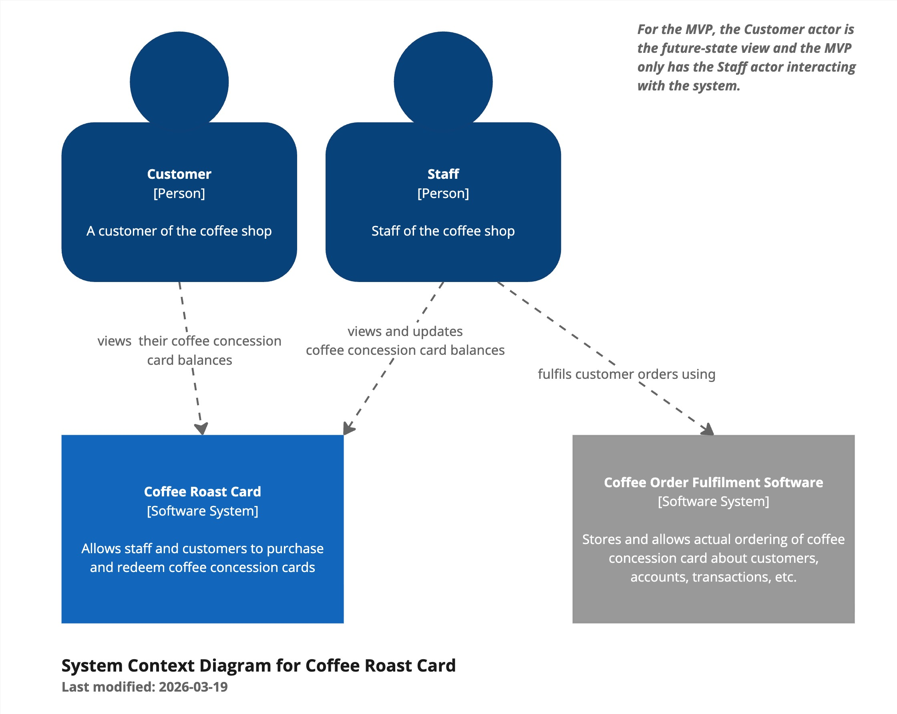
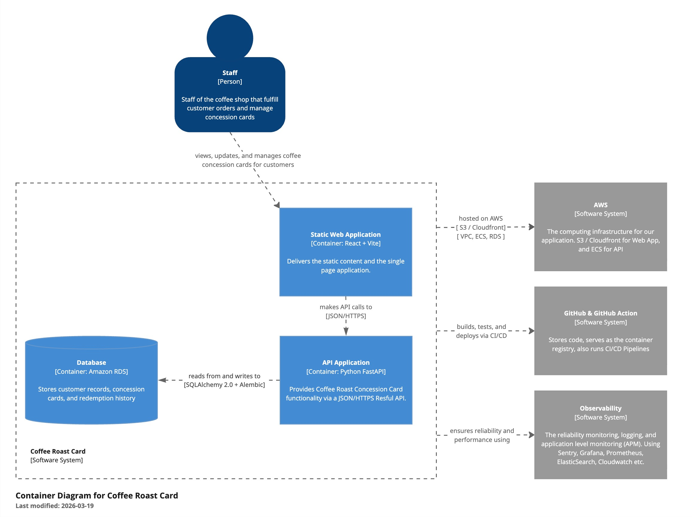

In 2022, a colleague introduced me to the C4 Model framework for architecture diagrams. At the time, I'd seen nothing like it. I'd often been in whiteboard sessions, struggling to make sense of all the boxes and lines people drew. Diagrams were drawn completely different depending on the person holding the marker.
This colleague was a star communicator and an inspiring solutions architect. Their ability to convey complex ideas clearly was a huge influence in me picking up the framework and running with it for my own diagrams.

### What is the C4 Model?

The C4 Model is a structured, uniform approach to describe the architecture of a software system at different level of detail. Instead of throwing everything onto a single diagram and hoping people get it, it organises abstractions in a way that mirrors how developers or software architects tend to think about systems.

The 4 levels are:

1. System Context - the big picture: your system and how it interacts with users and other systems.
2. Containers - the applications and data stores that make up your system.
3. Components - the building blocks of each of our containers.
4. Code - the classes, interfaces, and functions that implement each component.
   The official definition explains it best:
   > A software system is made up of one or more containers (applications and data stores), each of which contains one or more components, which in turn are implemented by one or more code elements (classes, interfaces, objects, functions, etc). And people (actors, roles, personas, named individuals, etc) use the software systems that we build.
   > Source: <https://arc.net/l/quote/kvovhsbn>
   > Visit the official website to read more detail about this framework.

### The map is not the territory

A book called The Great Mental Models: General Thinking Concepts has a chapter called "the map is not the territory". The idea being that the granularity of Google Maps, does not show the same level of detail as someone walking around on the ground. This is a similar line of reasoning useful when thinking about the C4 diagram.
For most intents and purposes, the maps context is enough to be useful at a high-level. But sometimes, we need more detail to understand what is going on under the hood. That's why we have these layers of abstraction, and at each abstraction we are targeting a different audience.

### The caveat at the code level

The creator of this framework, Simon Brown, recommends never manually building the lowest level C4 class diagram. It's not worth the effort of building, and definitely not worth keeping updated; especially with the pace at which software changes nowadays. The level of detail is normally so closely related to code that it can (and should) be generated automatically.
This is a pragmatic acknowledgement that diagrams are tools, not artefacts to be maintained for their own sake. If a diagram can't keep pace with reality, it quickly becomes a source of confusion rather than clarity.

### Examples from a personal project

I've been applying this framework in a recent pet project. If you'd like to see the diagrams in action, head over to the demo project here: devops-profile-coffee-card-app-demo.

#### Context

#### Containers

#### Components TBD

_Coming soon..._
